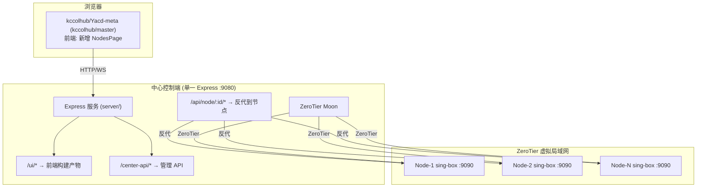

### singbox-center ###
所有代码统一放在 kccolhub/Yacd-meta 子仓的 kccolhub/master 分支中管理，包含前端二次开发 + 后端 Express 服务（内置反代）+ 节点配置 + 文档，配合 ZeroTier Moon 组网，实现 N 个 sing-box 客户端节点的统一代理管理。


# sing-box 中心化代理管理架构（kccolhub/Yacd-meta 统一管理）

## 架构概述

所有代码统一在 [kccolhub/Yacd-meta](https://github.com/kccolhub/Yacd-meta) 的 `kccolhub/master` 分支中管理。前端在原有 yacd-meta 基础上增加多节点管理 UI，后端 Express 服务（含反代）、节点配置、文档全部放在同一个仓库中。以 git submodule 方式引入到 `singbox-center/yacd-meta/`。



---

## Proposed Changes

### kccolhub/Yacd-meta 仓库目录结构（kccolhub/master 分支）

在原有 yacd-meta 项目结构基础上，新增 `server/`、`node-client/`、`zerotier/`、`docs/` 目录：

```
Yacd-meta/                                 # kccolhub/master 分支
├── package.json                           # [原有] 前端依赖
├── vite.config.ts                         # [原有] Vite 构建配置
├── tsconfig.json                          # [原有] 前端 TS 配置
├── index.html                             # [原有]
├── src/                                   # [原有 + 修改] 前端源码
│   ├── types.ts                           # [MODIFY] 增加 NodeInfo 等类型
│   ├── api/
│   │   ├── configs.ts                     # [原有]
│   │   ├── proxies.ts                     # [原有]
│   │   └── nodes.ts                       # [NEW] 节点管理 API 客户端
│   ├── store/
│   │   ├── app.ts                         # [原有]
│   │   └── nodes.ts                       # [NEW] 节点状态管理
│   ├── pages/
│   │   ├── HomePage.tsx                   # [原有]
│   │   ├── ProxiesPage.tsx                # [原有]
│   │   └── NodesPage.tsx                  # [NEW] 节点管理页面
│   ├── components/
│   │   ├── SideBar.tsx                    # [MODIFY] 增加 Nodes 导航
│   │   └── nodes/                         # [NEW] 节点组件目录
│   │       ├── NodeCard.tsx               # [NEW] 节点卡片
│   │       ├── NodeCard.module.scss       # [NEW]
│   │       ├── NodeList.tsx               # [NEW] 节点列表
│   │       └── NodeList.module.scss       # [NEW]
│   └── app/
│       └── router.tsx                     # [MODIFY] 增加 /nodes 路由
│
├── server/                                # [NEW] 中心端 Express 后端服务
│   ├── package.json                       # 后端依赖
│   ├── tsconfig.json                      # 后端 TS 配置
│   └── src/
│       ├── index.ts                       # 服务入口（静态托管 + 反代 + API）
│       ├── proxy.ts                       # 动态反向代理
│       ├── routes/
│       │   ├── nodes.ts                   # 节点管理 API
│       │   ├── subscription.ts            # 订阅管理 API
│       │   └── deploy.ts                  # 配置分发 API
│       ├── services/
│       │   ├── zerotier.ts                # ZeroTier 节点发现
│       │   ├── subscription.ts            # 订阅拉取/转换
│       │   └── deploy.ts                  # SSH 配置推送
│       ├── config/
│       │   ├── nodes.json                 # 节点列表持久化
│       │   ├── subscriptions.json         # 订阅源配置
│       │   └── template.json              # sing-box 配置模板
│       └── types.ts                       # 后端类型定义
│
├── node-client/                           # [NEW] 客户端节点部署资料
│   ├── config.json                        # sing-box 默认配置
│   └── SETUP.md                           # 节点部署文档
│
├── zerotier/                              # [NEW] ZeroTier 配置
│   └── SETUP.md                           # Moon 搭建文档
│
└── docs/                                  # [NEW] 项目文档
    ├── QUICK-START.md                     # 快速开始
    ├── CENTER-SETUP.md                    # 中心端部署
    ├── NODE-SETUP.md                      # 节点部署
    └── TROUBLESHOOTING.md                 # 故障排除
```

> [!TIP]
> 所有代码在一个仓库的一个分支里，开发、部署都更简单：
> ```bash
> cd yacd-meta
> pnpm build              # 构建前端
> cd server && npm start   # 启动后端（自动托管前端产物）
> ```

---

### 前端二次开发（src/ 目录）

#### [MODIFY] [types.ts](file:///Users/jokerw/Documents/kccolhub/proxy-install/singbox-center/yacd-meta/src/types.ts)
增加类型定义：
```typescript
export interface NodeInfo {
  id: string;
  name: string;
  ztIp: string;
  clashApiPort: number;
  secret: string;
  status: 'online' | 'offline' | 'unknown';
  hostname: string;
  singboxVersion?: string;
  trafficUp?: number;
  trafficDown?: number;
  lastSeen?: number;
}

export interface SubscriptionSource {
  id: string;
  name: string;
  url: string;
  nodeCount: number;
  lastUpdate: number;
}

export interface DeployResult {
  nodeId: string;
  success: boolean;
  message: string;
  timestamp: number;
}
```

#### [NEW] [src/api/nodes.ts](file:///Users/jokerw/Documents/kccolhub/proxy-install/singbox-center/yacd-meta/src/api/nodes.ts)
节点管理 API 客户端，与 Express `/center-api/*` 通信：
- `fetchNodes()` / `scanNodes()` / `addNode()` / `removeNode()`
- `fetchSubscriptions()` / `addSubscription()` / `updateSubscriptions()` / `generateConfig()`
- `deployConfig(nodeId)` / `deployConfigAll()`

#### [NEW] [src/store/nodes.ts](file:///Users/jokerw/Documents/kccolhub/proxy-install/singbox-center/yacd-meta/src/store/nodes.ts)
节点状态管理，使用 yacd-meta 原有 Store 模式（immer + dispatch）：
- `getNodes(state)` / `getSelectedNodeId(state)`
- `fetchAndSetNodes()` - 拉取节点列表
- `selectNode(nodeId)` - 选中节点并自动切换 `clashAPIConfig.baseURL` 到 `/api/node/{id}`

#### [NEW] [src/pages/NodesPage.tsx](file:///Users/jokerw/Documents/kccolhub/proxy-install/singbox-center/yacd-meta/src/pages/NodesPage.tsx)
节点管理页面，三个区域：
1. **节点面板**：卡片网格展示所有节点（在线状态、名称、ZT IP、流量）
2. **订阅管理**：订阅源列表、添加/删除/更新
3. **配置分发**：全量推送 / 选择节点推送

#### [NEW] [src/components/nodes/NodeCard.tsx](file:///Users/jokerw/Documents/kccolhub/proxy-install/singbox-center/yacd-meta/src/components/nodes/NodeCard.tsx) + [NodeCard.module.scss](file:///Users/jokerw/Documents/kccolhub/proxy-install/singbox-center/yacd-meta/src/components/nodes/NodeCard.module.scss)
节点卡片组件：在线状态灯、名称、ZT IP、实时流量、"管理"/"推送"按钮。

#### [NEW] [src/components/nodes/NodeList.tsx](file:///Users/jokerw/Documents/kccolhub/proxy-install/singbox-center/yacd-meta/src/components/nodes/NodeList.tsx) + [NodeList.module.scss](file:///Users/jokerw/Documents/kccolhub/proxy-install/singbox-center/yacd-meta/src/components/nodes/NodeList.module.scss)
节点列表组件，CSS Grid 网格布局。

#### [MODIFY] [src/components/SideBar.tsx](file:///Users/jokerw/Documents/kccolhub/proxy-install/singbox-center/yacd-meta/src/components/SideBar.tsx)
侧边栏增加 "Nodes" 导航入口（`Server` 图标，react-feather）。

#### [MODIFY] [src/app/router.tsx](file:///Users/jokerw/Documents/kccolhub/proxy-install/singbox-center/yacd-meta/src/app/router.tsx)
路由增加：
```typescript
const NodesPage = lazy(() => import('../pages/NodesPage'));
// routes 数组中增加
{ path: '/nodes', element: <NodesPage /> },
```

---

### 后端 Express 服务（server/ 目录）

#### [NEW] [server/package.json](file:///Users/jokerw/Documents/kccolhub/proxy-install/singbox-center/yacd-meta/server/package.json)
依赖：`express`、`cors`、`http-proxy-middleware`、`node-ssh`、`yaml`（解析 Clash 订阅）、`typescript`、`tsx`（运行 TS）。

#### [NEW] [server/src/index.ts](file:///Users/jokerw/Documents/kccolhub/proxy-install/singbox-center/yacd-meta/server/src/index.ts)
Express 服务入口，单一进程 :9080：
```typescript
// 1. /ui/* → 托管前端构建产物（../public/）
// 2. /center-api/* → 管理 API
// 3. /api/node/:id/* → 反代到节点 Clash API（含 WebSocket）
// 4. / → 重定向到 /ui/
```

#### [NEW] [server/src/proxy.ts](file:///Users/jokerw/Documents/kccolhub/proxy-install/singbox-center/yacd-meta/server/src/proxy.ts)
动态反向代理，使用 `http-proxy-middleware`：
- 根据 URL 中的 `nodeId` 从 `nodes.json` 查找对应节点的 ZeroTier IP
- 动态创建代理，支持 WebSocket（yacd-meta 的 traffic/logs 流需要）
- 自动注入 `Authorization: Bearer {secret}` 头

#### [NEW] [server/src/routes/nodes.ts](file:///Users/jokerw/Documents/kccolhub/proxy-install/singbox-center/yacd-meta/server/src/routes/nodes.ts)
- `GET /` - 节点列表
- `POST /scan` - ZeroTier 扫描发现
- `POST /` - 添加节点
- `DELETE /:id` - 删除节点
- `GET /:id/status` - 节点状态

#### [NEW] [server/src/routes/subscription.ts](file:///Users/jokerw/Documents/kccolhub/proxy-install/singbox-center/yacd-meta/server/src/routes/subscription.ts)
- `GET /` - 订阅源列表
- `POST /` - 添加订阅源
- `DELETE /:id` - 删除
- `POST /update` - 拉取更新
- `POST /generate` - 生成 sing-box 配置

#### [NEW] [server/src/routes/deploy.ts](file:///Users/jokerw/Documents/kccolhub/proxy-install/singbox-center/yacd-meta/server/src/routes/deploy.ts)
- `POST /:nodeId` - 推送到指定节点
- `POST /all` - 全量推送

#### [NEW] [server/src/services/zerotier.ts](file:///Users/jokerw/Documents/kccolhub/proxy-install/singbox-center/yacd-meta/server/src/services/zerotier.ts)
ZeroTier 节点发现：执行 `zerotier-cli listpeers` + 探测 9090 端口。

#### [NEW] [server/src/services/subscription.ts](file:///Users/jokerw/Documents/kccolhub/proxy-install/singbox-center/yacd-meta/server/src/services/subscription.ts)
订阅拉取/解析（Base64、Clash YAML）/转换为 sing-box outbound 格式。

#### [NEW] [server/src/services/deploy.ts](file:///Users/jokerw/Documents/kccolhub/proxy-install/singbox-center/yacd-meta/server/src/services/deploy.ts)
SSH 配置推送（`node-ssh`）：上传 config.json + 重启 sing-box。

#### [NEW] [server/src/config/template.json](file:///Users/jokerw/Documents/kccolhub/proxy-install/singbox-center/yacd-meta/server/src/config/template.json)
sing-box 配置模板（tun + mixed 入站、selector + urltest 出站、中国直连分流、Clash API `0.0.0.0:9090`）。

#### [NEW] [server/src/config/nodes.json](file:///Users/jokerw/Documents/kccolhub/proxy-install/singbox-center/yacd-meta/server/src/config/nodes.json)
节点列表初始文件（空数组）。

#### [NEW] [server/src/config/subscriptions.json](file:///Users/jokerw/Documents/kccolhub/proxy-install/singbox-center/yacd-meta/server/src/config/subscriptions.json)
订阅源初始文件（空数组）。

---

### 客户端节点（node-client/ 目录）

#### [NEW] [node-client/config.json](file:///Users/jokerw/Documents/kccolhub/proxy-install/singbox-center/yacd-meta/node-client/config.json)
sing-box 默认配置：Clash API `0.0.0.0:9090`、tun + mixed :20171、默认 direct。

#### [NEW] [node-client/SETUP.md](file:///Users/jokerw/Documents/kccolhub/proxy-install/singbox-center/yacd-meta/node-client/SETUP.md)
节点手动部署步骤：安装 sing-box → 安装 ZeroTier → 加入网络 → 加入 Moon → 部署配置 → 启动 → 防火墙。

---

### ZeroTier & 文档

#### [NEW] [zerotier/SETUP.md](file:///Users/jokerw/Documents/kccolhub/proxy-install/singbox-center/yacd-meta/zerotier/SETUP.md)
ZeroTier Moon 搭建文档。

#### [NEW] [docs/QUICK-START.md](file:///Users/jokerw/Documents/kccolhub/proxy-install/singbox-center/yacd-meta/docs/QUICK-START.md)
#### [NEW] [docs/CENTER-SETUP.md](file:///Users/jokerw/Documents/kccolhub/proxy-install/singbox-center/yacd-meta/docs/CENTER-SETUP.md)
#### [NEW] [docs/NODE-SETUP.md](file:///Users/jokerw/Documents/kccolhub/proxy-install/singbox-center/yacd-meta/docs/NODE-SETUP.md)
#### [NEW] [docs/TROUBLESHOOTING.md](file:///Users/jokerw/Documents/kccolhub/proxy-install/singbox-center/yacd-meta/docs/TROUBLESHOOTING.md)

---

## 关键技术决策

### 统一仓库管理的优势

| 对比项 | 分仓方案 | 统一子仓方案 |
|--------|---------|-------------|
| 仓库数 | 2个（主仓 + 子仓各自独立内容） | 1个子仓包含全部代码 |
| 部署 | 需要分别 clone 和构建 | `git clone` 一次，前后端都在里面 |
| 版本同步 | 前后端版本可能不一致 | 同一个 commit 保证一致 |
| CI/CD | 需要多个 pipeline | 一个 pipeline 搞定 |

### 开发 & 部署流程

```bash
# 开发
git clone https://github.com/kccolhub/Yacd-meta.git
cd Yacd-meta
git checkout kccolhub/master

# 前端开发
pnpm i && pnpm dev          # http://localhost:3000

# 后端开发
cd server && npm i && npx tsx src/index.ts   # http://localhost:9080

# 构建部署
pnpm build                   # 前端产物 → public/
cd server && npm start       # 后端托管 public/ + 反代 + API
```

### 端口规划

| 服务 | 端口 | 说明 |
|------|------|------|
| Express（统一入口） | 9080 | UI + 反代 + 管理 API |
| Vite dev server | 3000 | 仅开发时 |
| sing-box Clash API | 9090 | 每个节点（仅 ZeroTier 网段） |
| sing-box Mixed Proxy | 20171 | 每个节点本地代理 |
| ZeroTier | 9993/UDP | ZeroTier 通信 |

### 多节点切换机制

1. **NodesPage** 展示所有节点实时状态
2. 点击"管理" → `selectClashAPIConfig({ baseURL: '/api/node/{id}' })` → yacd-meta 切换后端
3. Express 收到 `/api/node/{id}/*` → `http-proxy-middleware` 反代到 `http://{zt_ip}:9090/*`
4. yacd-meta 原有 Proxies/Connections/Rules/Logs 页面无缝工作

## Verification Plan

### Automated Tests
- `pnpm build` 构建前端无报错
- `cd server && npm start` 启动正常
- `curl http://localhost:9080/ui/` 返回页面
- `curl http://localhost:9080/center-api/nodes` 返回节点列表
- `curl http://localhost:9080/api/node/node1/version` 反代正常

### Manual Verification
- 浏览器访问 `http://center:9080/ui/` 看到含 Nodes 导航的 yacd-meta
- Nodes 页面显示所有在线节点卡片
- 点击节点切换后端，Proxies 页面显示该节点代理组
- 添加订阅 → 生成配置 → 全量推送，各节点更新
- 扫描发现新 ZeroTier 节点


updateAtTime: 2026/4/17 16:50:10

planId: fe5ae7cf-6705-46be-bdfd-92c9a7c732c4